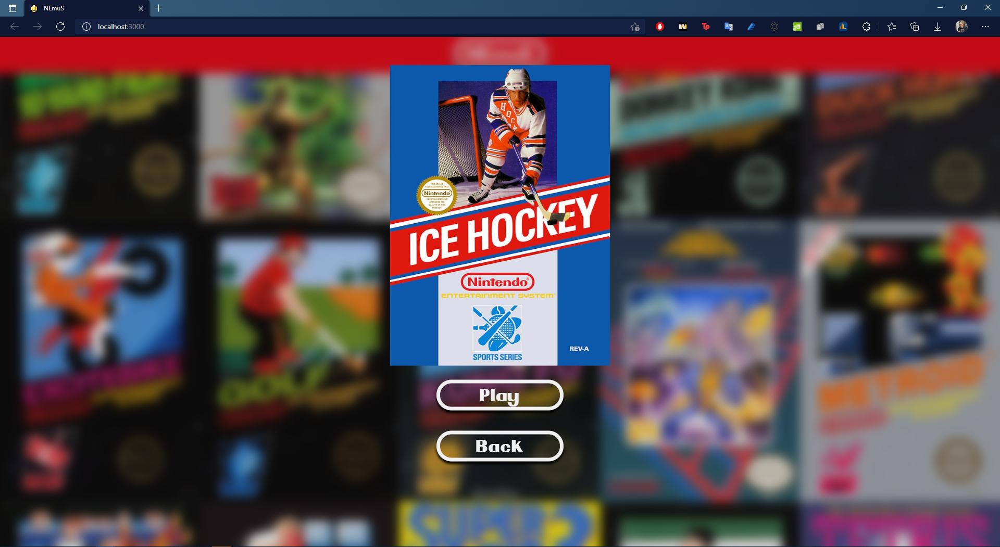

# NEmuS

NEmuS is web base NES console emulator. It's made for web development practice.

My project uses the [jsnes](jsnes) emulator engine.
NEmuS uses express server to download game catalog and roms  


## Screenshots 



## How to run it?

 1. First of all, You need to install dependances for NEmuS and the server. To do it just use ``` npm insatall ``` into main project directory and server directory.

2. To add some games, You need to make a new folder to ``` ./server/games``` directory and put two files in it:
    - cover art in jpg format.
    - rom in nes format.
E.g:

NEmuS/  
├─ server/  
│  ├─ games/  
│  │  ├─ {yourGame}/  
│  │  │  ├─ {yourGame}.jpg  
│  │  │  ├─ {yourGame}.nes

3. Run server app by opening terminal in a server directory and run ``` node app ``` and run client app by run ``` npx gulp ``` in main directory   